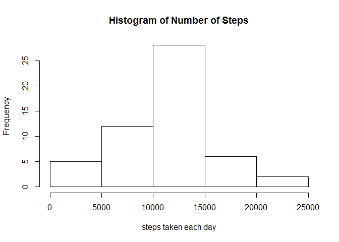
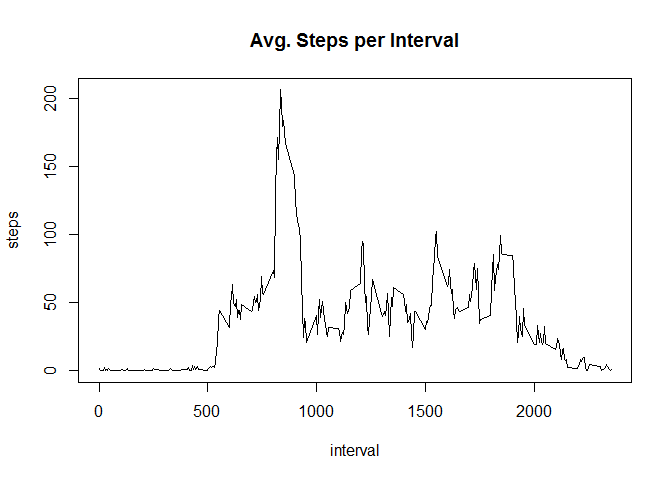
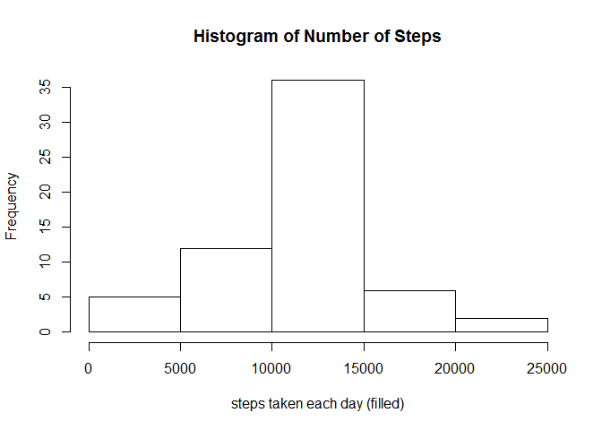

# Reproducible Research: Peer Assessment 1


## Loading and preprocessing the data

```r
data<-read.csv(file="activity.csv")
data$date<-as.Date(data$date,format="%d/%m/%Y")
steps_day<-aggregate(data$steps~data$date,data=data,mean,na.action=na.omit)
```

## Histogram of the number of steps taken each day:

```r
 hist(steps_day[,2],xlab="steps taken each day",main="Histogram of Number of Steps")
```

 


## The mean total number of steps taken per day is:

```r
mean(steps_day[,2],na.rm=TRUE)
```

```
## [1] 37.38
```
## The median number of steps taken per day is:

```r
median(steps_day[,2],na.rm=TRUE)
```

```
## [1] 37.38
```

##Time series plot of the 5-minute interval and the average number of steps taken, averaged across all days:

```r
steps<-aggregate(data$steps~data$interval,data=data,mean,na.action=na.omit)
plot(steps[,1],steps[,2],type="l",ylab="steps",main="Avg. Steps per Interval",xlab="interval")
```

 

##The 5-minute interval that contains the maximum number of stepstaken, averaged across all days is:

```r
steps[which.max(steps[,2]),1]
```

```
## [1] 835
```

##The number of missing observations (NA's) is:

```r
nrow(data[!complete.cases(data),])
```

```
## [1] 2304
```

## Imputing missing values & plotting histogram

```r
new_vals<-steps[,2]
new_vals<-rep(new_vals,nrow(data)/length(new_vals))
data_new<-data
missing <- which(is.na(data[,1]))
data_new[missing,1] <- new_vals[missing]
```

##Plotting histogram

```r
steps_day_new<-aggregate(data_new$steps~data_new$date,data=data,mean)
hist(steps_day_new[,2],xlab="steps taken each day (filled)",main="Histogram of Number of Steps")
```

 

##The mean total number of steps taken per day is:

```r
mean(steps_day_new[,2])
```

```
## [1] 37.38
```

##The median number of steps taken per day is:

```r
median(steps_day_new[,2])
```

```
## [1] 37.38
```

## Are there differences in activity patterns between weekdays and weekends?
###Adding a Weekend and Weekday factor

```r
data_new$weekend<-weekdays(data$date) %in% c("Saturday","Sunday")
data_new$weekday<-data_new$weekend==FALSE
```

###Plotting the results

```r
steps_new<-aggregate(data_new$steps~data_new$interval+data_new$weekend,data=data_new,mean)
colnames(steps_new)<-c("interval","weekend","steps")
steps_new$weekend[steps_new$weekend=="FALSE"]<-"weekday"
steps_new$weekend[steps_new$weekend=="TRUE"]<-"weekend"
library(lattice)
xyplot(steps_new[,3]~steps_new[,1] | steps_new[,2], type="l",layout=c(1,2),xlab="interval",ylab="Number of steps")
```

 

###Answer-yes there is a higher peak during the morning on weekdays.

